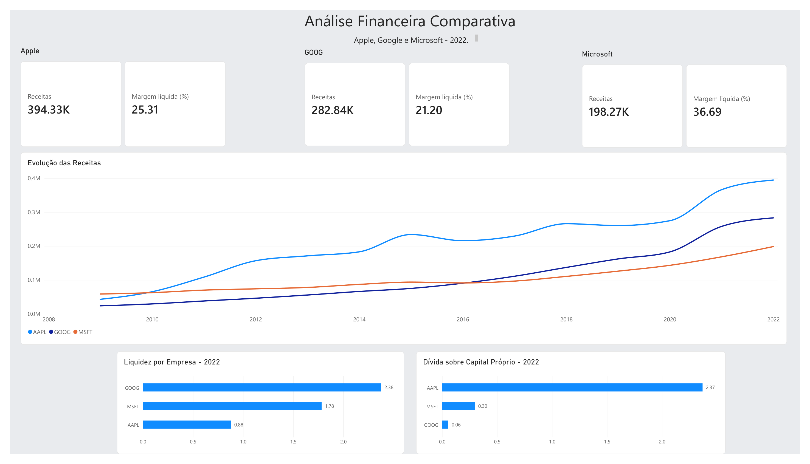
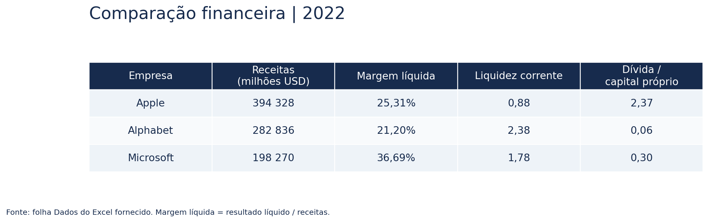
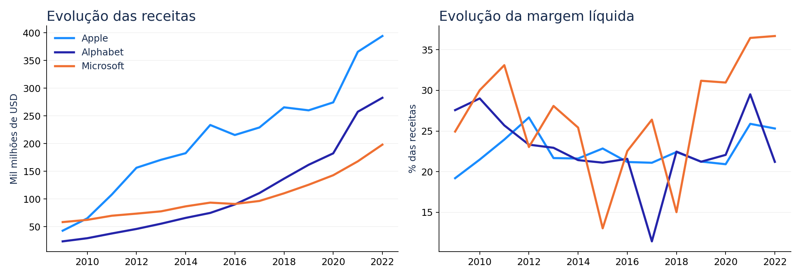

# Análise Financeira Comparativa
**Apple · Alphabet · Microsoft | Excel e Power BI | 2009–2022**

Projeto pessoal de análise financeira: da organização dos dados e cálculo de margens em Excel à comparação visual em Power BI.

[Consultar o relatório PDF](reports/dashboard.pdf) · [Descarregar Excel](analysis/analise_financeira.xlsx) · [Descarregar Power BI](powerbi/analise_financeira.pbix)

## Objetivo
Comparar crescimento das receitas, rentabilidade, geração de caixa, liquidez e endividamento de três empresas tecnológicas. A análise histórica abrange os anos fiscais de 2009 a 2022; os cartões do dashboard destacam 2022.

## Resultados principais
- **Apple lidera em receitas:** 394 328 milhões de USD em 2022, cerca de 1,99 vezes as receitas da Microsoft e 1,39 vezes as da Alphabet.
- **Microsoft lidera em margem líquida:** 36,69%, face a 25,31% da Apple e 21,20% da Alphabet. A margem de caixa operacional é também a mais elevada: 44,91%.
- **Alphabet apresenta maior liquidez corrente e menor dívida/capital próprio:** 2,38 e 0,06, respetivamente. Na Apple, os mesmos rácios são 0,88 e 2,37.

## Evolução histórica
A Apple termina o período com as maiores receitas, enquanto a Alphabet ultrapassa a Microsoft em receitas durante o período analisado. As margens variam de ano para ano, pelo que a comparação de 2022 deve ser enquadrada na série histórica.

Os dois visuais acima foram gerados a partir dos valores do Excel para facilitar a leitura no GitHub; a primeira imagem reproduz o PDF exportado do Power BI.

## Trabalho desenvolvido
1. Organização dos dados na folha `Dados` e seleção de Apple, Alphabet e Microsoft para comparação.
2. Cálculo da margem líquida, margem bruta e margem de caixa operacional em Excel.
3. Comparação da margem líquida calculada com o indicador fornecido pelo dataset.
4. Preparação das folhas de comparação, receitas, rentabilidade, caixa operacional, liquidez e endividamento.
5. Construção do dashboard em Power BI com cartões, séries históricas e filtros de empresa e ano.

### Cálculos no Excel
| Indicador | Cálculo |
| --- | --- |
| Margem líquida | Net Income / Revenue |
| Diferença de margem, em pontos percentuais | Net Margin Calculated × 100 − Net Profit Margin |
| Margem bruta | Gross Profit / Revenue |
| Margem de caixa operacional | Cash Flow from Operating / Revenue |

Os rácios de liquidez e dívida/capital próprio são utilizados conforme fornecidos no dataset.

## Ficheiros
| Pasta | Conteúdo |
| --- | --- |
| `data/` | CSV recebido e tabela comparativa de 2022 extraída do Excel |
| `analysis/` | Livro Excel com dados, fórmulas e análise |
| `powerbi/` | Relatório editável em Power BI Desktop |
| `reports/` | Exportação PDF do dashboard |
| `assets/` | Imagens apresentadas nesta página |
| `docs/` | Notas sobre dados e utilização |

## Unidades e interpretação
As receitas estão em **milhões de USD**, conforme indicado no Excel. No dashboard original, `394.33K` representa aproximadamente 394 330 milhões de USD: o sufixo K resulta da abreviação visual aplicada a valores já expressos em milhões. A tabela desta apresentação mostra os valores sem essa abreviação. Os rácios de liquidez e dívida/capital próprio não são percentagens.

Os exercícios fiscais das empresas podem terminar em datas diferentes. A análise descreve os dados históricos fornecidos e não constitui uma avaliação de investimento. Um rácio isolado não permite concluir sobre solvabilidade.

## Fonte e reprodução
Os ficheiros recebidos são preservados no pacote com nomes simplificados. O CSV já contém colunas de análise e não é apresentado como uma cópia verificada da fonte bruta. A origem pública e a licença do dataset ainda não foram identificadas; consultar [notas dos dados](docs/dados.md).

Para explorar o trabalho, abrir o Excel ou descarregar o `.pbix` e abrir em Power BI Desktop. Se a atualização do Power BI pedir a localização do Excel, apontar para `analysis/analise_financeira.xlsx` na pasta local.

## Autor
Pedro Fernandes · [GitHub](https://github.com/pedrof7-beep)
